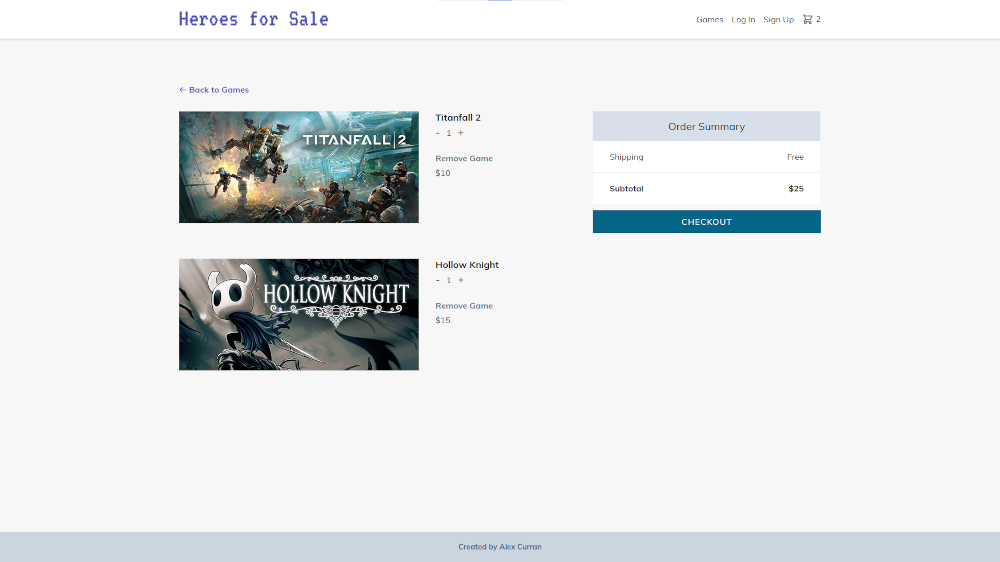

# Heroes for Sale (e-commerce site)

[View live site](https://heroes-for-sale.currandev.com)

## Features:

- Utilizes the Express JS framework, EJS templating, and MongoDB (Mongoose) for the database

- Full sign up, log in, and log out functionality with Passport JS for Auth

- Validation of incoming data verified by joi

- User passwords hashed through bcrypt

- Uses native Intl methods for date formatting

- Full Stripe integration for secure payment of game items

- Admin and user accounts supported

- Admin accounts allow for adding new game items, updating existing games, or deleting any game

- User accounts have full cart functionality, which enables users to add games to their carts, remove games, increase/decrease quantity, and checkout with Stripe payment

- Users may also leave ratings for any game, and ratings are averaged using Mongoose

#### Disclaimer: I do not own the rights to any games shown in this project. All rights belong to their respective companies, and are used in this site purely for educational, non-commercial purposes.

Images have been borrowed from [Steam](https://store.steampowered.com/).
